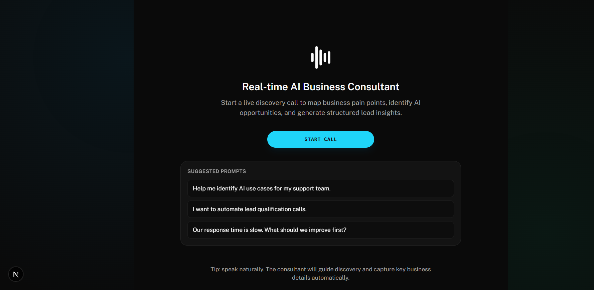
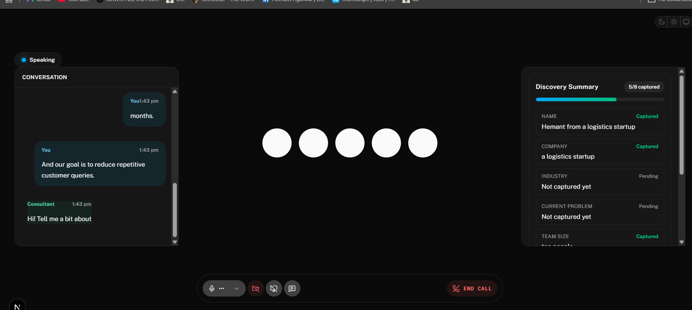
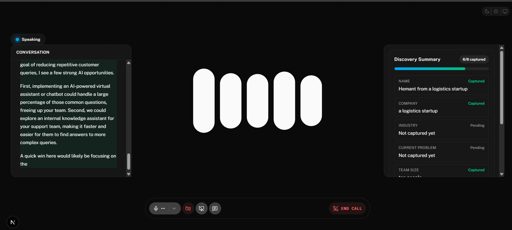
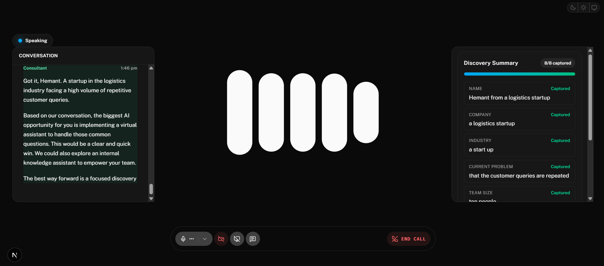

# Maneuver Voice AI - Real-Time AI Business Consultant

An AI-powered, real-time voice consultant that helps businesses discover practical AI opportunities through natural conversation.  
The system listens, understands business context, asks discovery-driven follow-up questions, and captures structured leads for later analysis and action.

## 1. Project Overview

Maneuver Voice AI is a full-stack voice consulting system designed for discovery calls. It combines real-time speech interaction, grounded AI reasoning, and structured lead capture into a single modern SaaS-style experience.

The solution is built with:
- `agent/` - Python backend voice agent
- `frontend/` - Next.js + React user interface

## 2. Problem Statement

Traditional business discovery calls are often:
- unstructured,
- difficult to summarize,
- and inconsistent in lead qualification.

Teams need a system that can guide conversations naturally, extract key business details in real time, and persist lead data in a reliable format without interrupting user experience.

## 3. Features

- Real-time voice conversation with AI consultant
- Live transcript generation during calls
- Structured business discovery workflow
- Lead capture fields:
  - name
  - company
  - industry
  - current problem
  - team size
  - timeline
  - budget
  - goals
- Knowledge-base grounded responses from `agent/src/kb.md`
- JSON lead storage (one lead per file)
- Graceful fallback messaging if Gemini/LLM fails
- Responsive, modern SaaS-style UI
- Tool-driven visual sync over LiveKit data channel (`ui.visual` topic)
- Founder dashboard to review captured leads (`/founder`)

## 4. Tech Stack

- **Frontend:** React, Next.js, TypeScript, Tailwind CSS
- **Backend:** Python
- **Realtime Voice Infrastructure:** LiveKit
- **LLM Layer:** Gemini
- **Data Storage:** Local JSON files (`agent/src/leads/`)

### Model and Provider Choices (with rationale)

- **STT:** `deepgram/nova-3` via LiveKit Inference  
  Chosen for fast, reliable real-time transcription quality.
- **LLM:** Gemini (`gemini-2.5-flash`) with fallback (`gemini-3-flash-preview`)  
  Chosen for low-latency conversational reasoning; fallback improves resilience when a model endpoint fails.
- **TTS:** `cartesia/sonic-3`  
  Chosen for natural voice quality and smooth conversational delivery.
- **Turn Detection:** LiveKit multilingual turn detector + Silero VAD  
  Chosen to reduce interruptions and improve natural pause handling.

## 5. System Architecture

```text
User Voice Input
   ->
Frontend (Next.js + React)
   ->
LiveKit Session
   ->
Python Agent (STT + LLM + TTS pipeline)
   ->
Knowledge Base Grounding (kb.md)
   ->
Discovery Capture + Lead JSON Storage
   ->
Frontend Transcript + Discovery Summary Panels
```

## 6. How It Works

1. User starts a voice session from the frontend.
2. Speech is transcribed in real time and sent to the AI agent.
3. The consultant responds conversationally using business-aware prompting and KB grounding.
4. Discovery fields are collected naturally over the conversation.
5. Structured lead data is saved to a JSON file once sufficient details are captured.
6. If model response fails, the system returns a graceful fallback and keeps the session active.

## 7. Project Workflow

1. **Session Initialization**  
   Frontend connects to LiveKit and starts the voice pipeline.
2. **Conversation Phase**  
   User and AI interact in real time with transcript updates.
3. **Discovery Phase**  
   AI gathers business details through guided, natural prompts.
4. **Lead Persistence**  
   Captured fields are saved as one JSON lead record.
5. **Review and Follow-up**  
   Discovery summary and transcript history support post-call analysis.

## 8. Screenshots

### Welcome Screen


### Live Session - Mid Conversation


### Recommendation Generation in Progress


### Discovery Complete (8/8 Captured)


### Live Visual Layer (Bonus)
- The center panel reacts to conversation context in real time:
  - services view
  - service-detail focus
  - process diagram
  - pricing and case-study cards

## 9. Installation and Setup

### Prerequisites

- Python (recommended with `uv`)
- Node.js and npm
- LiveKit Cloud project credentials
- Gemini API key

### Backend Setup

```powershell
cd agent
uv sync
copy .env.example .env.local
uv run python src/agent.py download-files
uv run python src/agent.py dev
```

### Frontend Setup

```powershell
cd frontend
npm install
copy .env.example .env.local
npm run dev
```

Open: `http://localhost:3000`
Founder view: `http://localhost:3000/founder`

## 10. Environment Variables

### `agent/.env.local`

```env
LIVEKIT_URL=wss://<project-subdomain>.livekit.cloud
LIVEKIT_API_KEY=<your_livekit_api_key>
LIVEKIT_API_SECRET=<your_livekit_api_secret>
GOOGLE_API_KEY=<your_google_api_key>
```

### `frontend/.env.local`

```env
LIVEKIT_API_KEY=<your_livekit_api_key>
LIVEKIT_API_SECRET=<your_livekit_api_secret>
LIVEKIT_URL=wss://<project-subdomain>.livekit.cloud
GOOGLE_API_KEY=<your_google_api_key>
AGENT_NAME=
```

## 11. Demo Conversation Example

**User:** Hi, I run a logistics company and want to automate inbound support calls.  
**AI Consultant:** Great, happy to help. May I start with your name and company?  
**User:** I am Rohan from SwiftRoute Logistics.  
**AI Consultant:** Thanks, Rohan. What is the biggest problem your team faces today?  
**User:** Delays in responding to customer shipment queries.  
**AI Consultant:** Understood. What timeline and budget range are you considering for a pilot rollout?

Captured lead fields are then persisted in `agent/src/leads/<timestamp>_company_name.json`.

## 12. Future Improvements

- CRM integration for direct lead sync
- Analytics dashboard for conversation insights
- Multi-language discovery support
- Cloud database storage instead of local JSON
- Role-based access and admin controls
- Automatic opportunity scoring and prioritization

## 13. Contributors

- **Hemant** - Project Lead, Backend + Frontend Integration
- **Team Maneuver Voice AI** - Product Design, Testing, and UX Iteration

---

If you are evaluating this project, please refer to the architecture and workflow sections for implementation depth and system design clarity.
